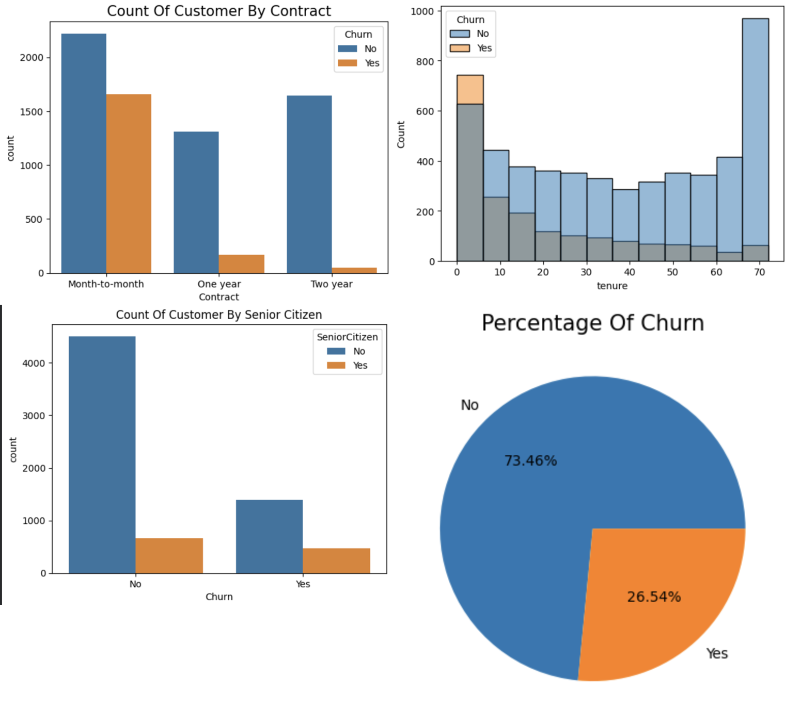
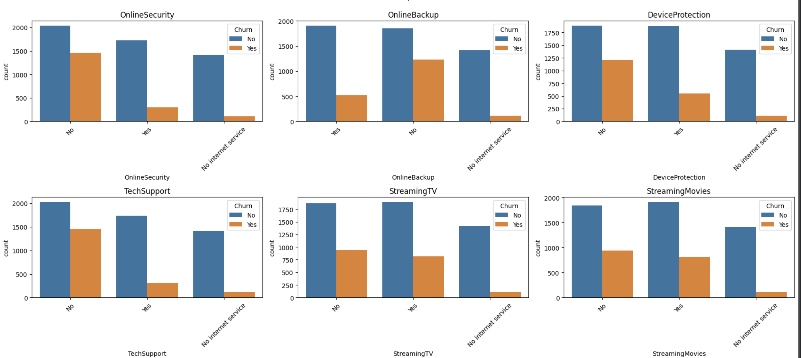

# Customer Churn Analysis

# THIS IS MY FIRST EDA PRACTICE PROJECT IN THE WORLD OF ML

This project focuses on analyzing customer churn patterns using data analysis and visualization techniques.

## Project Overview

Customer churn is a major challenge for telecom companies.  
In this project, I explored the dataset to understand why customers leave and what factors influence churn.

The analysis includes:
1- Data cleaning
2- Exploratory Data Analysis (EDA)
3- Visualization of churn patterns
4- Key insights from the data

## Key Insights

- **26.54% customers churned** while **73.46% remained with the company**.
- Customers with **Month-to-Month contracts show the highest churn rate**.
- Customers with **shorter tenure are more likely to churn**.
- **Senior citizens have a slightly higher churn rate compared to others**.

### Customer Churn Dashboard

### Additional Charts

## Tools Used

Python
Pandas
Matplotlib
Seaborn
Google Colab

## Goal

The goal of this project is to understand customer behavior and help businesses develop strategies to **reduce churn and improve customer retention**.
